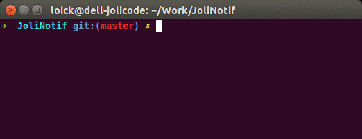

# JoliNotif

[](https://packagist.org/packages/jolicode/jolinotif)
[](https://packagist.org/packages/jolicode/jolinotif)
[](https://packagist.org/packages/jolicode/jolinotif)
[](https://travis-ci.org/jolicode/JoliNotif)
[](https://insight.sensiolabs.com/projects/9220d9bc-bb95-4478-b64e-78257f15266b)

PHP >= 5.4

JoliNotif is a PHP library to send notifications to your desktop directly from
your script. It takes care of using the right binary available, without having
to worry if you're running on Linux, Windows or MacOS.



For example, if you have a long running PHP task - like executing a large test
suite, launching a deployment script - you can use JoliNotif to inform your
users that a task just finished.

## Installation

Use [Composer](http://getcomposer.org/) to install JoliNotif in your project:

```shell
composer require "jolicode/jolinotif"
```

## Usage

Use the `NotifierFactory` to create a `Notifier` according to which notifiers
are available on your system, then use it to send your notification:

```php
include __DIR__.'/vendor/autoload.php';

use Joli\JoliNotif\Notification;
use Joli\JoliNotif\NotifierFactory;

// Create a Notifier
$notifier = NotifierFactory::create();

// Create your notification
$notification =
    (new Notification())
    ->setTitle('Notification title')
    ->setBody('This is the body of your notification')
    ->setIcon(__DIR__.'/path/to/your/icon.png')
    ->addOption('subtitle', 'This is a subtitle') // Only works on macOS (AppleScriptNotifier)
    ->addOption('sound', 'Frog') // Only works on macOS (AppleScriptNotifier)
;

// Send it
$notifier->send($notification);
```

## Further documentation

Discover more by reading the docs:

* [Basic usage](doc/01-basic-usage.md)
* [Notification](doc/02-notification.md)
* [Notifier](doc/03-notifier.md)
* [Advanced usage](doc/04-advanced-usage.md)

You can see the current and past versions using one of the following:

* the `git tag` command
* the [releases page on Github](https://github.com/jolicode/JoliNotif/releases)
* the file listing the [changes between versions](CHANGELOG.md)

And finally some meta documentation:

* [versioning and branching models](VERSIONING.md)
* [contribution instructions](CONTRIBUTING.md)

## Credits

* [All contributors](https://github.com/jolicode/JoliNotif/graphs/contributors)
* This project was originally inspired by [mikaelbr/node-notifier](https://github.com/mikaelbr/node-notifier)

## License

JoliNotif is licensed under the MIT License - see the [LICENSE](LICENSE) file
for details.
